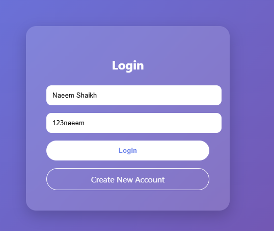
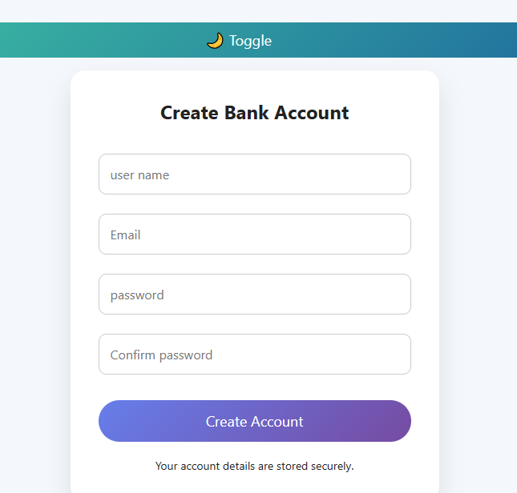
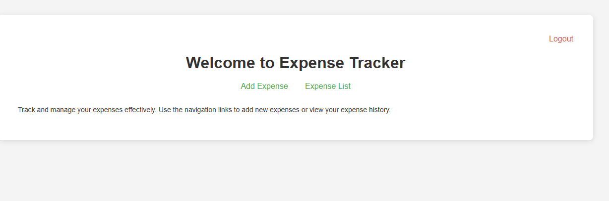
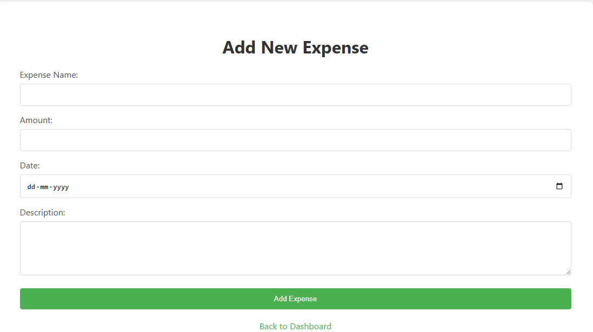
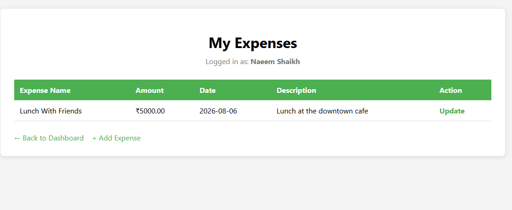
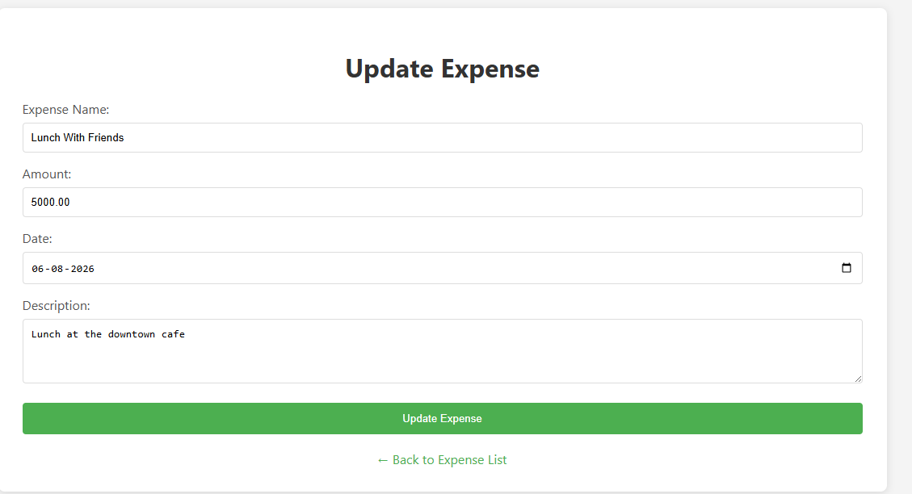

# 💰 Expense Tracker

A simple web-based **Expense Tracker application** developed using **Java Spring Boot, Spring Data JPA, Thymeleaf, and MySQL**.

The application allows users to create an account, log in, add expenses, view their expenses, and update existing expenses.

---

## 📌 Features

- 👤 User Registration
- 🔐 User Login
- 🏠 Dashboard
- ➕ Add New Expense
- 📋 View My Expenses
- ✏️ Update Expense
- 🔒 User Session Management
- 👤 User-specific Expenses
- 🗄️ MySQL Database Integration
- 🌐 Thymeleaf-based Web Interface

---

## 📸 Screenshots

### 🔐 Login Page

### 👤 Create Account

### 🏠 Dashboard

### ➕ Add Expense

### 📋 My Expenses

### ✏️ Update Expense

## 🛠️ Technologies Used

| Technology | Purpose |
|------------|---------|
| Java | Backend programming |
| Spring Boot | Application framework |
| Spring MVC | Request and controller handling |
| Spring Data JPA | Database operations |
| Hibernate | ORM |
| Thymeleaf | Frontend template engine |
| MySQL | Database |
| HTML | Web pages |
| CSS | Page styling |
| Maven | Dependency management |
| Git & GitHub | Version control |

---

